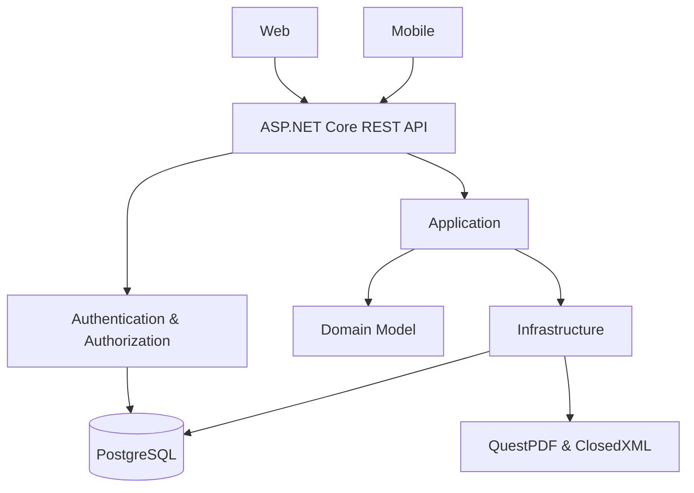

# Food4Groups

An end-to-end group catering management platform developed as an engineering thesis project.

Food4Groups supports the entire catering workflow for organized groups. The system allows administrators, catering staff, dietitians, group coordinators, and customers to manage meal packages, menus, orders, and settlement reports within a single application ecosystem.

The project demonstrates how business requirements can be translated into a layered software architecture consisting of a shared REST API, web and mobile clients, role-based authorization, and a relational database.

---

## Technology Stack

| Area | Technologies |
|------|--------------|
| Backend | C#, .NET 10, ASP.NET Core, Entity Framework Core |
| Web | React, TypeScript, Vite, Material UI |
| Mobile | React Native, Expo, TypeScript |
| Database | PostgreSQL |
| Authentication | ASP.NET Core Identity, JWT |
| Reporting | QuestPDF, ClosedXML |
| Tooling | Docker Compose, Nginx, Swagger |

---

## Architecture



## Features

- Role-based workflows for five user roles:
  - Administrator
  - Catering Employee
  - Dietitian
  - Group Coordinator
  - Customer
- Shared ASP.NET Core REST API consumed by both web and mobile applications
- Layered backend architecture (Domain, Application, Infrastructure, API)
- Menu period and daily menu management
- Catering package management
- Group and participant management
- Order creation and order status management
- JWT authentication and role-based authorization
- PDF pro-forma settlement reports
- Excel daily order reports
- Docker Compose configuration for local development

---

The application follows a layered architecture. Business rules, validation, and authorization are implemented in the backend, while both client applications consume the same REST API. Data persistence is handled by the Infrastructure layer using Entity Framework Core and PostgreSQL.

---


## Running the Project

### Prerequisites

- Docker Desktop
- Git

### 1. Clone the repository

```bash
git clone https://github.com/kmlynek/Food4Groups.git
cd Food4Groups
```

### 2. Create a `.env` file

Create a `.env` file in the project root:

```env
API_PORT=8080
WEB_PORT=5173

POSTGRES_PORT=5433
POSTGRES_DB=food4groups
POSTGRES_USER=postgres
POSTGRES_PASSWORD=food4groups_local_dev

JWT_KEY=Food4Groups_LocalDevelopment_Key
JWT_ISSUER=Food4Groups
JWT_AUDIENCE=Food4Groups.Client
```

> These values are intended for local development only.

### 3. Start the application

```bash
docker compose up --build -d
```

The following services will be started automatically:

- ASP.NET Core REST API
- React web application
- PostgreSQL database
- Nginx reverse proxy

### Application URLs

| Service | URL |
|---------|-----|
| Web Application | http://localhost:5173 |
| Swagger UI | http://localhost:8080/swagger |

---

## Demo Accounts

| Role | Email | Password |
|------|-------|----------|
| Administrator | admin@food4groups.com | Admin123! |
| Customer | user@food4groups.com | Test123! |

> Demo accounts are automatically seeded for local development and demonstration purposes.

---

## Mobile Application

The repository also contains a React Native mobile application built with Expo.

The mobile client focuses on the customer ordering workflow and communicates with the same ASP.NET Core REST API as the web application.

---
